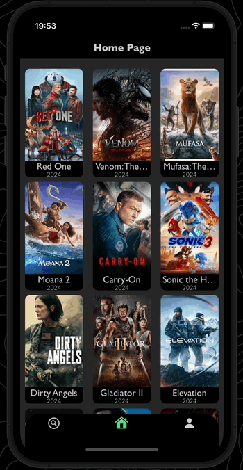
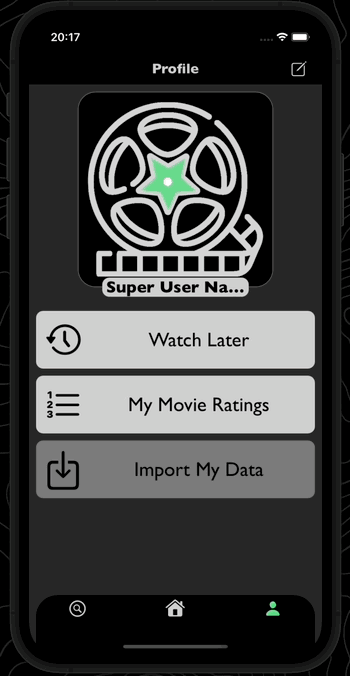
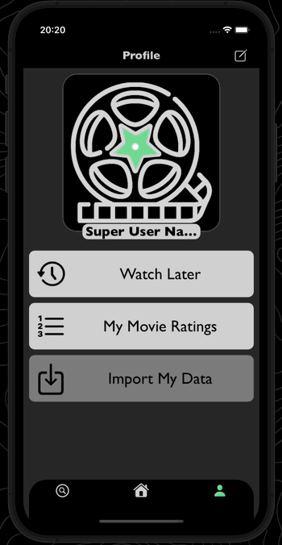

<div align="center">
  <h1><strong>StarMovie</strong></h1>
</div>
<div align="center">
  
</div>
<div align="center">
      
</div>

## Table of Contents
1. [Overview](#overview) 
2. [Home Screen](#home-screen) 
3. [Search Screen](#search-screen) 
4. [User Screen](#user-screen) 
5. [Future Plans](#future-plans)
6. [Installation](#installation)  
7. [Technical Details](#technical-details)  
8. [Resources](#resources) 
9. [Contact Me](#contact-me)
___
## Overview
**StarMovie** - is an app designed to help you discover new movies, TV shows, cartoons, and anime. The app allows you to create, store, and track your movie library, regularly adding to it and ensuring that no content you want to watch is ever lost. It features a search functionality that lets you find any movie you're interested in and instantly add it to your library.

The app consists of three main screens, each with its unique functionality. Below is a detailed description of each.

## Home Screen
This is the main screen of the app, welcoming users upon launch. On this screen, users can browse a large library of trending movies and the latest releases.

By tapping on a movie, the user is taken to a detailed screen with comprehensive information about the selected movie. This includes the movie's title, release date, original language, poster, and description. A beautiful animation displays the average user rating for the movie, and users can also rate the movie with stars and add it to their library for later viewing. Additionally, users can watch a trailer for the selected movie directly within the app, with trailers being streamed seamlessly from YouTube.

Here's a demonstration of the Home Screen in action:

<div align="center">
  
</div>

This shows the detailed movie screen, where users can view comprehensive information, rate movies, and add them to their library:

<div align="center">
  
</div>

## Search Screen
This screen features movies categorized by genre, with an easy way to navigate between them by simply selecting a category at the top of the screen. Switching genres is accompanied by a smooth animation, and the selected genre will be centered on the screen for better visibility.

Additionally, you can search the app’s extensive movie library by typing the title of a movie or TV show and series you're interested in. Selecting a movie will take you to the detailed movie screen, just like on the Home Screen. Tapping the cross in the search bar will bring you back to the genre-based movie list.

Here’s how the genre switch works:  

<div align="center">
  
</div>

This demonstrates how you can search for movies by title:  

<div align="center">
  
</div>

## User Screen
The final main screen is the User Screen. Here, users can view their profile, which consists of an avatar and a username. Both can be edited by tapping the edit button at the top of the screen.
Here’s how profile editing works:  

<div align="center">
  
</div>

From this screen, users can also navigate to their movie collections: movies they’ve rated and movies they plan to watch later.

When accessing the "Watch Later" collection, users will see a list of movies they’ve added to this category, including their titles, posters, release dates, and original language. The collection is available offline, making it convenient for situations where you’re trying to recall a movie but don’t have internet access. Additionally, each movie in the collection features a checkbox on the right side. This allows users to mark movies as watched. Once marked, the movie will shift to the bottom of the list, ensuring that unwatched movies remain at the top. The collection is dynamic and can be refreshed by simply swiping down when at the top of the list.
Here’s how users can mark movies as watched:  

<div align="center">
  
</div>

On the "Rated Movies" screen, users will find a collection of movies they’ve rated. This collection displays the title, poster, release date, and the user’s rating on the right side.
Here’s how rated movies are displayed in the collection:  

<div align="center">
  
</div>

At the bottom of the User Screen, there’s a gray button. Currently, this button is inactive, but in future versions of the app, it will allow users to export their movie data to a text file.

## Future Plans  
In future versions of the app, we plan to add the following features:  
1. **Export Movie Lists to a Text File:**  
   This feature will allow users to export their movie lists as a beautifully formatted text file, ready for printing. For those who value the tactile experience, this will let users physically cross off movies they’ve watched.  
2. **Cross-Device Synchronization via iCloud:**  
   To ensure that users can access and manage their movie library across multiple devices, such as another iPhone or iPad, synchronization via iCloud will be implemented. This solution avoids the need for additional user registration. Simply installing the app on another Apple device will allow users to seamlessly access their library.  
3. **Integrate a Streaming API:**  
   Finding an affordable or free API that provides access to full movies with streaming capabilities is a key goal. This would eliminate the current dependency on YouTube for trailer playback and shift the app’s focus toward becoming an online cinema. Additionally, a subscription model could be introduced, allowing access to higher-quality, paid APIs for streaming movies.  

## Installation  
> **!Attention!**  
> The movieDB API is currently unavailable in Russia and some other CIS countries. To use it, you need to use a VPN or Proxy.  

For the app to work correctly, you need to register and get an API key (free of charge) from several resources:  

1. **movieDB** - [link](https://developer.themoviedb.org/docs/getting-started)  
   - Register on this resource.  
   - Go to [this link](https://www.themoviedb.org/settings/api) and register your API.  
   - Save your "API Key" and "API Access Key" details.  

2. **YouTube API v3** - [link](https://developers.google.com/youtube/v3)  
   - Register or create a new Google account.  
   - Google provides a comprehensive guide on registering your app and getting a YouTube API key – [follow it here](https://developers.google.com/youtube/v3/getting-started). You only need to complete the "Before you start" section.  
   - Register your app and get your "YouTube API key".  

### Installation and Setup  
To run the app, you will need a Mac or Hackintosh with Xcode and CocoaPods dependency manager installed.  

1. Download the latest version of the project [here]() or clone it using the `git clone` command and extract it to a directory of your choice.  
2. Open Terminal and navigate to the project directory:  
   ```bash
   cd (Your Directory)/StarMovie
   ```  
   Then install dependencies by running:  
   ```bash
   pod install
   ```  
3. Open the project in Xcode using the created file `StarMovie.xcworkspace`.  
4. Navigate to the `Resources.swift` file located at `StarMovie -> StarMovie -> Helpers -> Resources.swift`.  
5. Enter your movieDB API key and API access key:  

   ```swift
   enum UrlMovieDB {
       // Enter your API Key data received 
       static let keyApi = " "//enter your API Details
       static let accessKeyAPI = " "//enter your API Read Access Token
       static let baseURL = "https://api.themoviedb.org/3/"
       static let imageUrlPath = "https://image.tmdb.org/t/p/w500/"
       static let searchUrlPath = "https://api.themoviedb.org/3/search/movie"
       static let searchMovieListPath = "https://api.themoviedb.org/3/discover/movie"
       static let movieByIdUrlPath = "https://api.themoviedb.org/3/movie/"
   }
   ```

6. Enter your YouTube API key from YouTube API v3:  

   ```swift
   enum UrlYouTube {
       static let keyAPI = " "//enter your API Key
       static let baseSearhcURL = "https://youtube.googleapis.com/youtube/v3/search"
   }
   ```
   
7. Everything is ready! You can now run the project by clicking the run button or using the keyboard shortcut `cmd + R`.

## Technical Details
- **Swift**: Version 5  
- **Xcode**: Version 16.0  
- **Minimum Supported iOS Version**: 14.0  
- **UI Framework**: UIKit (fully programmatically, no Interface Builder used)  
- **Architecture**: VIPER  
- **Concurrency**: Implemented using Swift Concurrency (`async/await`)  
- **Networking and Data Layer**: Local services and entities created with `URLSession` and persistent storage implemented using `CoreData`  
- **Dependency Manager**: CocoaPods  
- **Third-party Frameworks**:  
    - Alamofire: Version 5.8.0  
    - Kingfisher: Version 7.12.0  
    - Lottie: Version 4.3.3  
    - SnapKit: Version 5.6.0  
    - YouTube iOS Player Helper: Version 1.0.4  
- **Test coverage**: 25%
- **Test coverage of application services**: 100%
  
## Resources
- [YouTube Data API v3](https://developers.google.com/youtube/v3/docs/)  
- [MovieDB API](https://www.themoviedb.org/settings/api)
  
## Contact Me
Have any questions or feedback? Feel free to reach out:
- **Email**: weganoise@gmail.com
- **Telegram**: [@vaalzevoov](https://t.me/vaalzevoov)

